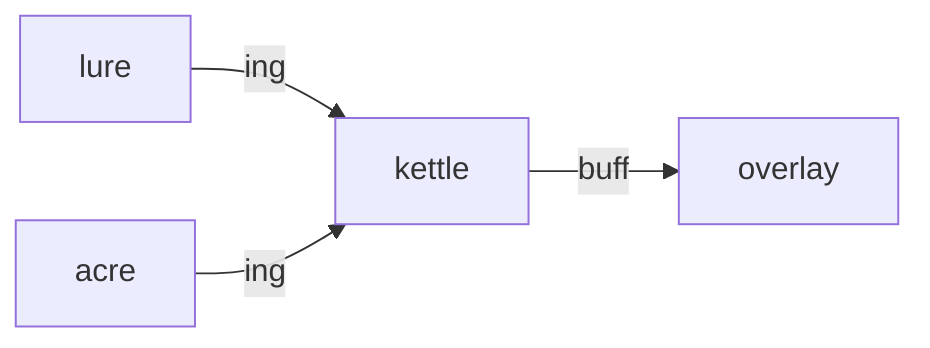

# Kettle

**Pet Cooking Dash** — Time-management cooking game that prepares stat-boosting meals for overlay care.

Part of [ComputerPets](https://github.com/RicheyWorks/computerpets). Map: [computerpets-ecosystem](https://github.com/RicheyWorks/computerpets-ecosystem).

| | |
| --- | --- |
| Status | Design scaffold — loop and engine frozen |
| License | MIT |
| Tokens | Minigames never mint or burn. Tired overlay, not a dead lineage. |
| First pet | [Meet Rui first](https://github.com/RicheyWorks/computerpets/blob/main/docs/START-HERE.md). This game is optional. |

## The loop

Feed is currently a click. Kettle makes the meal: recipes keyed to species (bamboo steam for Rui, brine for Paint). Buffs expire. Burned food still feeds, no buff.

## Who plays

Players who want feed to mean a meal.

## What it is not

Not a poison sandbox. Visiting pets cannot be harmed.

## Genre and engine

- Genre: **Arcade kitchen**
- Engine: **Unity**
- Stack: Unity 6 · C# · time-management stations · meals apply overlay buffs
- Default surface: `Unity editor`

## Architecture



## How you play

1. Ticket queue of hungry pets (yours + visitors).
2. Cook within patience timer.
3. Plate = care event with buff JSON.
4. Visiting pets cannot be poisoned — canon gate.

## First slice

Build this and stop.

**One recipe (bamboo steam for Rui) applying a timed overlay buff.**

You know it works when: Timer zero: dish dumped, pet hungry, overlay alive. Unknown species: generic chow.

## Environment

Unity 6

## Failure doctrine

Timer to zero → dish dumped, pet stays hungry, overlay does not crash. Recipe missing species → generic chow.

Canon rules that never yield:

- 210 living kinds. No illegal hybrids.
- Overlay pets can get tired, sick, or hide. Tokens are not burned by a minigame.
- Desktop walk stays the main quest. Closing Kettle must leave Rui walking.

## Neighbors

- computerpets (feed + buffs)
- computerpets-lure (ingredients)
- computerpets-acre (crops)
- computerpets-ledger

## Layout

```
computerpets-kettle/
  README.md
  LICENSE
  docs/DESIGN.md
  src/                implementation lands here
```

## Run (Windows)

```powershell
Unity Hub > open Kettle/; play mode. Meals POST to flagship care API.
```

Meet Rui first via the [flagship start-here](https://github.com/RicheyWorks/computerpets/blob/main/docs/START-HERE.md). This game is optional.

## Links

- Flagship: [RicheyWorks/computerpets](https://github.com/RicheyWorks/computerpets)
- This repo: [RicheyWorks/computerpets-kettle](https://github.com/RicheyWorks/computerpets-kettle)
- Map: [RicheyWorks/computerpets-ecosystem](https://github.com/RicheyWorks/computerpets-ecosystem)
- Design file: [docs/DESIGN.md](docs/DESIGN.md)

## License

MIT. See [LICENSE](LICENSE).

---

*Two hundred ten living kinds. Keep them so a line does not go quiet.*
